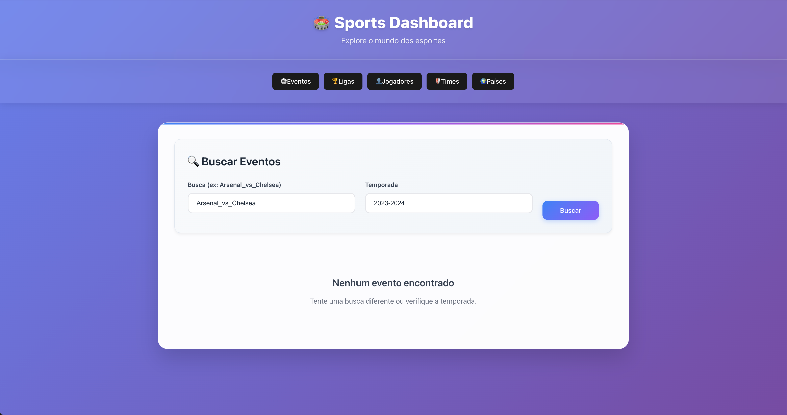

# 🏆 Sports Data Explorer



Uma aplicação web moderna construída com **SolidJS** para explorar dados esportivos em tempo real. Consulte países, ligas, times, jogadores e eventos de forma intuitiva e responsiva.

## 📋 Índice

- [Visão Geral](#-visão-geral)
- [Funcionalidades](#-funcionalidades)
- [Tecnologias](#-tecnologias)
- [Instalação](#-instalação)
- [Uso](#-uso)
- [Estrutura do Projeto](#-estrutura-do-projeto)
- [API](#-api)
- [Componentes](#-componentes)
- [Contribuição](#-contribuição)
- [Troubleshooting](#-troubleshooting)

## 🎯 Visão Geral

O **Sports Data Explorer** é uma interface web que permite aos usuários:

- 🌍 **Explorar países** disponíveis no banco de dados esportivos
- 🏆 **Navegar pelas ligas** de diferentes esportes
- 🛡️ **Buscar times** por esporte e país
- 👤 **Encontrar jogadores** por nome
- 📅 **Consultar eventos** e partidas

## ✨ Funcionalidades

### 🌍 Aba Países (CountriesTab)
- Lista todos os países disponíveis
- Filtro de busca em tempo real
- Nomes em múltiplos idiomas (PT, ES, FR, DE)
- Contador de resultados filtrados

### 🏆 Aba Ligas (LeaguesTab)
- Exibe todas as ligas esportivas
- Informações sobre esporte e nomes alternativos
- Carregamento automático na inicialização

### 🛡️ Aba Times (TeamsTab)
- Busca por esporte e país
- Informações detalhadas: liga, estádio, ano de fundação
- Descrições em português quando disponíveis

### 👤 Aba Jogadores (PlayersTab)
- Busca por nome do jogador
- Dados completos: nacionalidade, posição, time, características físicas
- Biografias resumidas

### 📅 Aba Eventos (EventsTab)
- Busca por confrontos específicos (ex: Arsenal_vs_Chelsea)
- Filtro por temporada
- Informações de data, local, placar
- Status dos jogos

## 🚀 Tecnologias

- **[SolidJS](https://www.solidjs.com/)** - Framework reativo moderno
- **JavaScript ES6+** - Linguagem principal
- **CSS3** - Estilização responsiva
- **Sports API** - Fonte dos dados esportivos
- **Vite** (recomendado) - Build tool e dev server

## 📦 Instalação

### Pré-requisitos
- Node.js (versão 16+)
- npm ou yarn

### Passos

1. **Clone o repositório**
   ```bash
   git clone https://github.com/seu-usuario/sports-data-explorer.git
   cd sports-data-explorer
   ```

2. **Instale as dependências**
   ```bash
   npm install
   # ou
   yarn install
   ```

3. **Configure as variáveis de ambiente**
   ```bash
   cp .env.example .env
   ```
   
   Edite o arquivo `.env` com suas configurações:
   ```env
   VITE_SPORTS_API_BASE_URL=https://www.thesportsdb.com/api/v1/json/3
   VITE_APP_NAME=Sports Data Explorer
   ```

4. **Execute em modo de desenvolvimento**
   ```bash
   npm run dev
   # ou
   yarn dev
   ```

5. **Acesse a aplicação**
   Abra [http://localhost:3000](http://localhost:3000) no seu navegador.

## 💡 Uso

### Navegação Básica

1. **Explore Países**: Acesse a aba "Países" para ver todos os países disponíveis
2. **Filtre Resultados**: Use a barra de busca para encontrar países específicos
3. **Busque Times**: Na aba "Times", digite o esporte e país desejados
4. **Encontre Jogadores**: Digite o nome do jogador na busca
5. **Consulte Eventos**: Use o formato "Time1_vs_Time2" para buscar jogos

### Exemplos de Busca

```javascript
// Buscar times
Esporte: "Soccer"
País: "England"

// Buscar jogadores  
Nome: "Cristiano Ronaldo"

// Buscar eventos
Busca: "Arsenal_vs_Chelsea"
Temporada: "2023-2024"
```

## 📁 Estrutura do Projeto

```
src/
├── components/
│   ├── tabs/
│   │   ├── CountriesTab.jsx     # Lista de países
│   │   ├── LeaguesTab.jsx       # Lista de ligas
│   │   ├── TeamsTab.jsx         # Busca de times
│   │   ├── PlayersTab.jsx       # Busca de jogadores
│   │   └── EventsTab.jsx        # Busca de eventos
│   ├── LoadingSpinner.jsx       # Componente de loading
│   └── ErrorMessage.jsx         # Tratamento de erros
├── services/
│   └── sportsApi.js             # Chamadas para API
├── styles/
│   └── main.css                 # Estilos globais
└── App.jsx                      # Componente principal
```

## 🔌 API

### Serviço Sports API (`services/sportsApi.js`)

```javascript
// Funções disponíveis
getAllCountries()     // Lista todos os países
getAllLeagues()       // Lista todas as ligas  
searchTeams(sport, country)  // Busca times
searchPlayers(name)   // Busca jogadores
searchEvents(query, season)  // Busca eventos
```

### Endpoints Utilizados

- `GET /search_all_teams.php` - Buscar times
- `GET /searchplayers.php` - Buscar jogadores  
- `GET /searchevents.php` - Buscar eventos
- `GET /all_countries.php` - Listar países
- `GET /all_leagues.php` - Listar ligas

## 🧩 Componentes

### Padrão dos Componentes Tab

Todos os componentes seguem a mesma estrutura:

```javascript
// Estados básicos
const [loading, setLoading] = createSignal(false)
const [error, setError] = createSignal(null)  
const [data, setData] = createSignal([])

// Estados de busca (quando aplicável)
const [searchQuery, setSearchQuery] = createSignal('')

// Função de busca/carregamento
const loadData = async () => {
  setLoading(true)
  setError(null)
  try {
    const result = await apiCall()
    setData(result)
  } catch (err) {
    setError('Mensagem de erro')
  } finally {
    setLoading(false)
  }
}
```

### Componentes de UI

- **LoadingSpinner**: Indicador de carregamento
- **ErrorMessage**: Exibição de erros com botão de retry
- **Cards Grid**: Layout responsivo para exibição de dados

## 🤝 Contribuição

### Como Contribuir

1. **Fork o projeto**
2. **Crie sua feature branch**
   ```bash
   git checkout -b feature/MinhaNovaFuncionalidade
   ```
3. **Faça commit das mudanças**
   ```bash
   git commit -m 'Adiciona nova funcionalidade'
   ```
4. **Push para a branch**
   ```bash
   git push origin feature/MinhaNovaFuncionalidade
   ```
5. **Abra um Pull Request**

### Padrões de Código

- Use **nomes descritivos** para variáveis e funções
- Mantenha **componentes pequenos** e focados
- Implemente **tratamento de erro** adequado
- Adicione **loading states** em operações assíncronas
- Use **sinais do SolidJS** para reatividade

## 🔧 Troubleshooting

### Problemas Comuns

#### ❌ Erro: "Cannot load countries"
**Causa**: Problema de conexão com a API
**Solução**: 
- Verifique sua conexão com a internet
- Confirme se a URL da API está correta no `.env`
- Tente novamente usando o botão "Tentar Novamente"

#### ❌ Erro: "No results found"  
**Causa**: Busca sem resultados
**Solução**:
- Verifique a ortografia dos termos de busca
- Tente termos mais genéricos
- Para times: confirme se o país existe na base de dados

#### ❌ Componente não carrega
**Causa**: Erro de importação ou dependência
**Solução**:
```bash
# Reinstale as dependências
npm install --force

# Limpe o cache
npm run clean
npm run dev
```

### Logs de Debug

Para habilitar logs detalhados:

```javascript
// Adicione no início do arquivo
const DEBUG = import.meta.env.DEV

// Use nos componentes
if (DEBUG) console.log('Estado atual:', data())
```

### Performance

Para melhorar a performance:

- Use **lazy loading** para dados grandes
- Implemente **debounce** em campos de busca
- Cache resultados frequentes no **localStorage**

## 📄 Licença

Este projeto está licenciado sob a [MIT License](LICENSE).

## 🌟 Agradecimentos

- **TheSportsDB** - API de dados esportivos
- **SolidJS** - Framework fantástico e performático
- **Comunidade Open Source** - Por todas as contribuições

---

**Desenvolvido com ❤️ e ☕**

> 💡 **Dica**: Este README foi criado para ser seu guia completo. Se algo não estiver claro, não hesite em abrir uma issue!